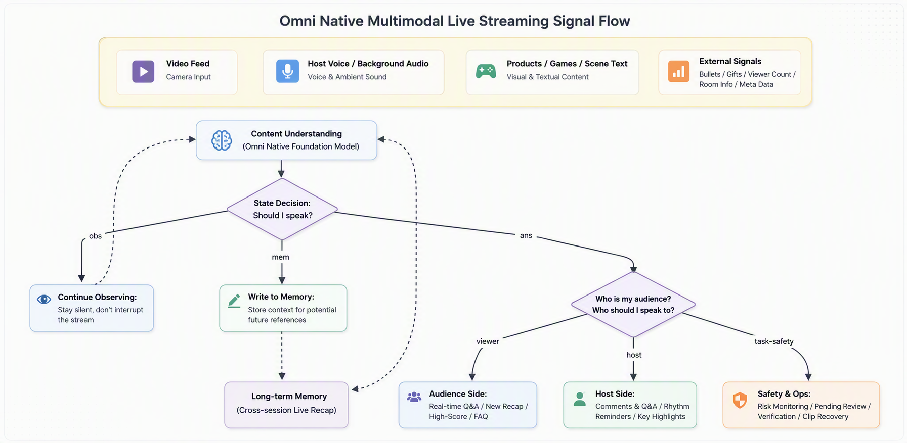
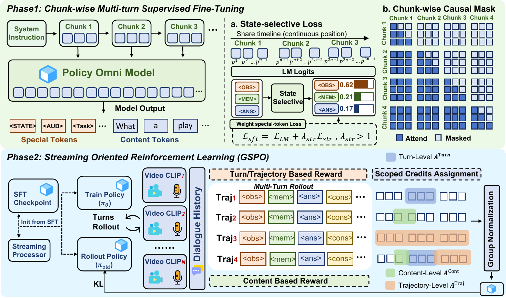
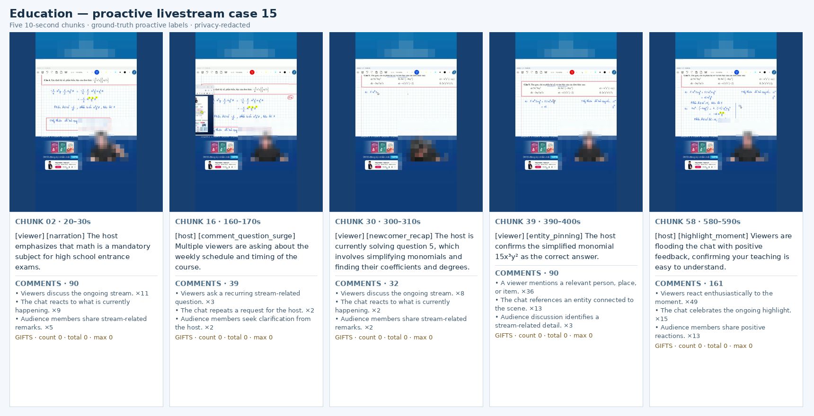

<div align="center">

# 🎥 LiveAssistant

### Towards Proactive Omni-Modal Reasoning over Real-World Livestream

<p align="center">
  <em>Learning <b>when to stay silent</b>, <b>when to remember</b>, and <b>whom to speak to</b> — in a live social environment.</em>
</p>

<p align="center">
  <a href="#"></a>
  <a href="#"></a>
  <a href="#"></a>
  <a href="./LICENSE"></a>
  
</p>

<p align="center">
  <b>Shujian Gao</b><sup>1,2,3</sup>&nbsp;&nbsp;
  Jiamei Yan<sup>2</sup>&nbsp;&nbsp;
  Penghao Zhou<sup>2,†</sup>&nbsp;&nbsp;
  Qinglei Wang<sup>2,†</sup>&nbsp;&nbsp;
  Zuxuan Wu<sup>1,3,*</sup>&nbsp;&nbsp;
  Yu-Gang Jiang<sup>1,*</sup>
</p>

<p align="center">
  <sup>1</sup> Institute of Trustworthy Embodied AI, Fudan University&nbsp;&nbsp;
  <sup>2</sup> ByteDance TikTok&nbsp;&nbsp;
  <sup>3</sup> Shanghai Innovation Institution
</p>

<p align="center"><sub><sup>*</sup> Corresponding author&nbsp;&nbsp;<sup>†</sup> Project lead</sub></p>


<sub>📌 Figure 1 (interaction protocol).</sub>

</div>

---

## 📄 TL;DR

> Most streaming video models assume their job is to **keep talking** — narrate every chunk or answer every explicit query.
> **LiveAssistant** challenges that assumption. It reframes livestream understanding as **selective participation in a shared social environment**: at every incoming chunk the model decides *whether* to act, *whom* to address (viewer / host / moderator), and *what* to say — including the choice to **stay silent**.

<div align="center">

| The three questions LiveAssistant answers every 10 seconds | State |
|:--|:--:|
| Should I act right now, or just keep watching? | `<obs>` |
| Should I quietly record this for later? | `<mem>` |
| Should I speak — and to whom, about what? | `<ans>` |

</div>

---

## ✨ Highlights

- 🧭 **A new problem, not a higher score.** Instead of chasing another video-QA leaderboard, LiveAssistant defines a *native* livestream task: causal, mixed-initiative decision-making over heterogeneous, long-horizon, multi-party signals.
- 🗣️ **"Whom to speak to" is a first-class decision.** The model routes each action to **viewers, hosts, or moderators** — the step almost every prior online-video model skipped.
- 🎧 **Truly Omni-modal.** Native video **+** audio **+** comments **+** gifts **+** viewer dynamics **+** room metadata, fused directly — not "frames + ASR text".
- 🤫 **Silence is a valid action.** `<obs>` and `<mem>` are supervised as deliberate decisions, so the model learns restraint instead of over-talking.
- 🏗️ **Trajectory data engine.** Reconstructs replay timelines from HLS slices, aligns heterogeneous signals into 10-second decision trajectories, with automatic checks and human review.
- 🎯 **Two-stage training.** Marker-Aware Multiturn SFT (**MA-MSFT**) → Streaming Multiturn GSPO (**SM-GSPO**), plus agent-in-the-loop reward optimization and bounded-cache streaming inference.

---

## 🧩 The Action Protocol

LiveAssistant compresses every livestream chunk into one of three structured actions:

```text
<obs>                                  → keep observing; do not disturb the stream
<mem> ... </mem>                       → write a private clue to memory (not spoken)
<ans> <viewer|host> [task] ... </ans>  → speak to a specific recipient with a concrete task
```

The `task` vocabulary spans real livestream needs, e.g.
`narration` · `key event` · `highlight moment` · `viewer QA` · `entity pinning` · `pacing alert` · `newcomer recap` · `FAQ gap` · `safety alert`.

> The same event can route differently. *"Many comments asking about size"* → a **FAQ answer** for viewers, or a **cue to the host** to clarify. *"The stream suddenly goes quiet"* → often nothing for viewers, but a **pacing alert** for the host.

<div align="center">

<br><sub>📌 Figure 1: the obs/mem/ans decision skeleton with state feed-back loop.</sub>
</div>

---

## 🔬 Method Overview

The framework has six layers, from signals to training to inference:

<div align="center">

<br><sub>📌 Figure 2: the data & training pipeline.</sub>
</div>

**1. Omni-native livestream signals.** Video, audio, text and platform signals are encoded by their towers and serialized in temporal order — host tone, background sound, comment density, gift events and viewer swings all shape the decision.

**2. Content-driven state machine × multi-party feedback.** Routing is *part of* the policy, not post-processing. One autoregressive pass produces activation, recipient and content from a shared causal representation.

**3. MA-MSFT — learn the action grammar.** Structured targets are highly length-asymmetric (an `OBS` is one token; `ANS`/`MEM` are many). A **marker-weighted vocabulary loss** plus an auxiliary **state candidate loss** keep rare-but-critical structural decisions from being drowned out by response text — while preserving open-vocabulary generation.

**4. SM-GSPO — optimize the policy.** Turn-by-turn causal rollouts where each generation feeds the next context (fixing exposure mismatch). A **hierarchical reward** enforces *structure before semantics*, combined with **turn-level** and **trajectory-level** credit for both local correctness and long-horizon restraint.

**5. Long-stream inference.** A two-tier cache: dense recent window at full resolution + compressed long-term memory, aligned by turn so an event's video/audio/comments stay together.

**6. Train–inference consistency.** Data annotation, SFT and RL are all built around the *same* continuous trajectory, minimizing the classic streaming train/inference gap.

---

## 📊 Benchmark & Results

A **three-party, human-verified** benchmark under strictly causal inputs (native audio + video + comments + gifts). Streams are split **by room** to remove leakage.

<div align="center">

| Statistic | Optimization corpus | Benchmark |
|:--|--:|--:|
| Livestream rooms | 123 | 14 |
| Continuous clips | 2,049 | 275 |
| Unique chunks | 115,938 | 13,812 |
| Duration (hours) | 320.80 | 38.17 |
| Comments | 4,124,223 | 625,119 |
| Gifts | 104,146 | 19,217 |
| Content categories / language groups | 9 / 2 | 9 / 2 |

<sub>Benchmark state distribution is deliberately non-trivial: **48.2% OBS · 25.9% MEM · 25.9% ANS**, penalizing both "always talk" and "always silent" policies.</sub>

</div>

### Main results (full livestream inputs, A+V+C+G, %)

<div align="center">

| Method | State (All) | OBS | MEM | ANS | Recip. | Task | Count | Gemini | Hard |
|:--|:--:|:--:|:--:|:--:|:--:|:--:|:--:|:--:|:--:|
| Qwen3-Omni polling | 0.00 | 0.00 | 0.00 | 0.00 | 0.00 | 0.00 | 0.00 | 0.00 | 0.00 |
| MA-MSFT | 70.05 | **87.06** | 36.50 | 72.00 | 66.42 | 52.55 | 72.00 | **83.90** | 81.56 |
| **MA-MSFT + SM-GSPO** ★ | **71.14** | 83.31 | **44.50** | **75.17** | **69.23** | **55.61** | **75.14** | 81.78 | **82.32** |

</div>

> **Reading the numbers.** The untrained base model scores **0** — the task lies outside its instruction-following distribution, confirming this is a genuinely new capability. SM-GSPO improves the decisions that matter most (MEM +8.0, ANS +3.2, recipient +2.8, task +3.1, count +3.1, Hard +0.8) with an *honest, reported* trade-off on OBS (−3.75) and content score (−2.12) — a real activation-vs-content tension rather than a uniform gain.

<div align="center">

<br><sub>📌 Figure 3: a real livestream case showing the obs/mem/ans timeline.</sub>
</div>

---

## 💡 Why It Matters

LiveAssistant serves an entire live scene, not a single user:

- 👥 **For viewers** — real-time narration, background recap for newcomers, highlight cues, direct answers.
- 🎙️ **For hosts** — surfacing comment questions, pacing alerts, key product/game moments, audience feedback.
- 🛡️ **For moderators** — grounded risk cues, anomaly flags, and clips that need review during long streams.

It moves livestream understanding from **passive answering** toward **content-driven proactive collaboration** — the piece a real production system arguably needs most: *not talking more, but knowing when to talk and whom to talk to.*

---

## 🗂️ Repository Structure

```text
LiveAssistant/
├── README.md              # You are here
├── README_zh.md           # 中文版
├── LICENSE
├── CITATION.cff
├── docs/                  # GitHub Pages project homepage
│   ├── index.html
│   └── static/            # css / js / images
└── assets/                # figures & media
```

---

## 🚧 Status & Roadmap

This repository currently hosts the **project narrative, benchmark description, and homepage**. Code, model weights, and data release are planned.

- [x] Project page & documentation
- [ ] Paper (arXiv) link
- [ ] Benchmark data & evaluation scripts
- [ ] Training code (MA-MSFT / SM-GSPO)
- [ ] Model checkpoints (HuggingFace)

---

## 📖 Citation

If you find this work useful, please consider citing:

```bibtex
@article{gao2025liveassistant,
  title   = {Live Assistant: Towards Proactive Omni-Modal Reasoning over Real-World Livestream},
  author  = {Gao, Shujian and Yan, Jiamei and Zhou, Penghao and Wang, Qinglei and Wu, Zuxuan and Jiang, Yu-Gang},
  journal = {arXiv preprint},
  year    = {2025}
}
```

---

## 🙏 Acknowledgements

This project is a joint effort of the **Institute of Trustworthy Embodied AI, Fudan University**, the **TikTok Livestream Content Understanding Team**, and the **Shanghai Innovation Institution**. It is built on real TikTok livestream scenarios and data to explore real-world livestream understanding, memory, and feedback.

<div align="center">
<sub>Made with ❤️ for real-world live rooms · Contributions & issues welcome.</sub>
</div>
