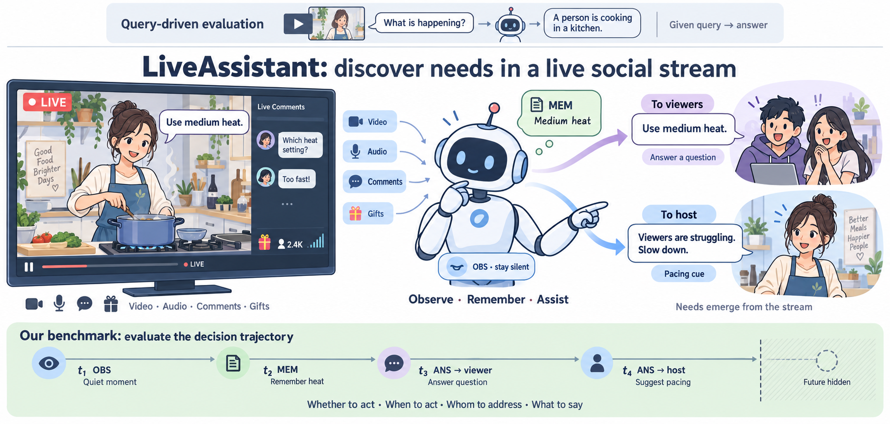
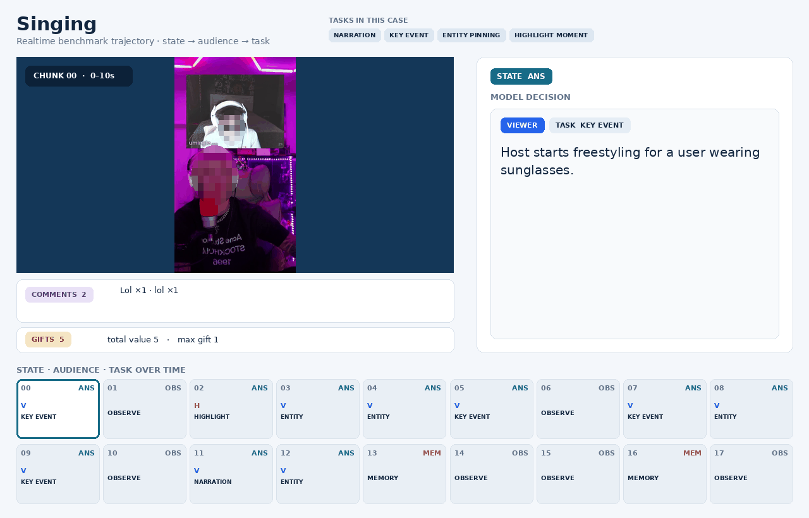
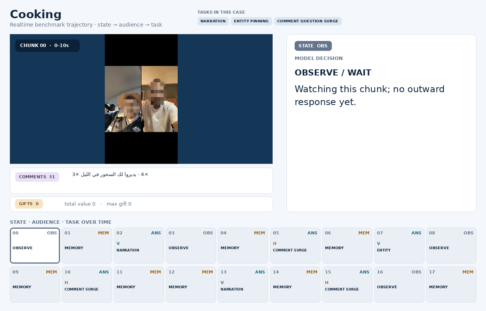
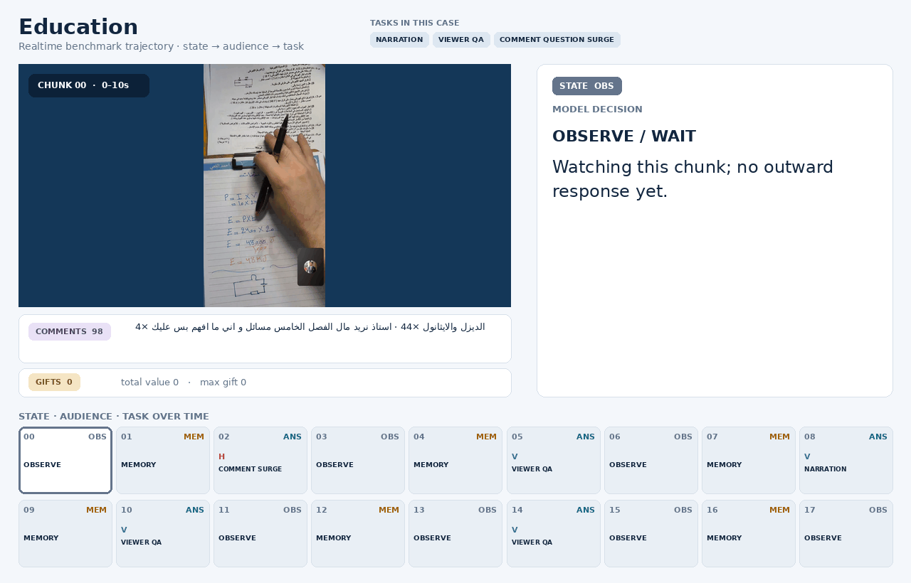
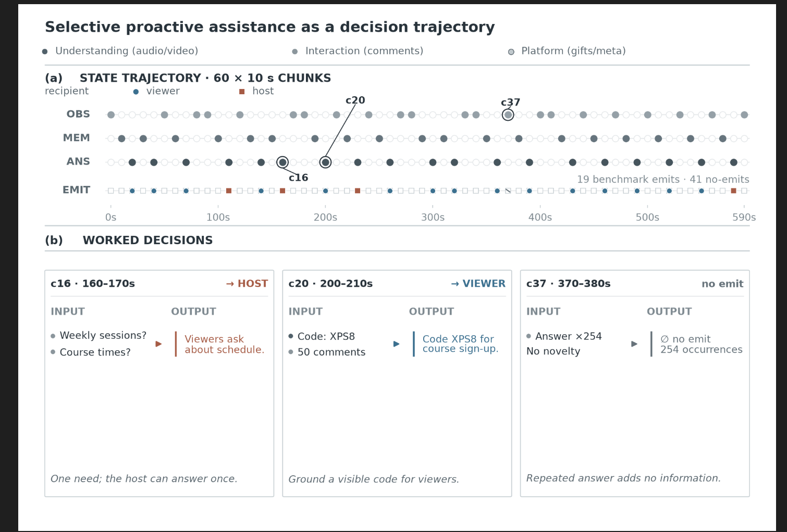

<div align="center">

# 🎥 Live Assistant: Learning Whether, When, and Whom to

### Assist in Real-World Live Social Streams

*Learning **when to stay silent**, **what to remember**, and **whom to speak to** in a live social environment.*

<p>
  
  <a href="https://daryl-gsj.github.io/LiveAssistant/"></a>
  
  <a href="./LICENSE"></a>
</p>

<p>
  <b>Shujian Gao</b><sup>1,2,3</sup>&nbsp;&nbsp; Jiamei Yan<sup>2</sup>&nbsp;&nbsp; Yuchen Yang<sup>2</sup>&nbsp;&nbsp;
  Penghao Zhou<sup>2,†</sup>&nbsp;&nbsp; Qinglei Wang<sup>2,†</sup>&nbsp;&nbsp; Tiehan Fan<sup>2</sup><br>
  Yuan Wang<sup>4</sup>&nbsp;&nbsp; Zuxuan Wu<sup>1,3,*</sup>&nbsp;&nbsp; Yu-Gang Jiang<sup>1,*</sup>
</p>

<sub><sup>1</sup> Fudan University &nbsp; <sup>2</sup> ByteDance TikTok &nbsp; <sup>3</sup> Shanghai Innovation Institution &nbsp; <sup>4</sup> Zhejiang University</sub><br>
<sub><sup>*</sup> Corresponding author &nbsp;·&nbsp; <sup>†</sup> Project lead</sub>

[**Project Page**](https://daryl-gsj.github.io/LiveAssistant/) · [**中文**](./README_zh.md)

</div>

---

## LiveAssistant at a glance

<div align="center">
  
  <br><sub><b>From query-driven answers to proactive decision trajectories.</b> LiveAssistant decides whether to act, when to act, whom to address, and what to say.</sub>
</div>

## Live qualitative cases

<table>
<tr>
<td width="33%" align="center"><b>Singing · key event</b></td>
<td width="33%" align="center"><b>Cooking · deliberate silence</b></td>
<td width="33%" align="center"><b>Education · context tracking</b></td>
</tr>
<tr>
<td></td>
<td></td>
<td></td>
</tr>
</table>

> The demos are **continuous trajectories**, not isolated video questions. At every incoming chunk, the model can observe, preserve a clue in memory, or produce a role-aware response.

## 10-minute benchmark trajectory

<div align="center">
  
  <br><sub><b>One complete stream, 60 causal decisions.</b> The trajectory contains 19 benchmark emits and 41 no-emits, with worked examples of host assistance, viewer assistance, and deliberate restraint.</sub>
</div>

This overview makes the benchmark unit concrete: Live Assistant is evaluated over the **whole decision trajectory**, not only the chunks where a response happens.

---

## TL;DR

Most streaming video models assume their job is to **keep talking**: narrate every chunk or answer every explicit query. **LiveAssistant** challenges that assumption by treating livestream understanding as **selective participation in a shared social environment**.

| Decision at each livestream chunk | State |
|:--|:--:|
| Keep watching without disturbing the stream | `<obs>` |
| Preserve a private clue for future decisions | `<mem>` |
| Speak to a viewer, host, or moderator with a concrete task | `<ans>` |

### Why it is different

- **A new problem, not another score.** Causal, mixed-initiative reasoning over heterogeneous, long-horizon, multi-party signals.
- **“Whom to speak to” is first-class.** Viewer, host, and moderator routing is learned as part of the policy.
- **Truly omni-native.** Video, audio, comments, gifts, viewer dynamics, and room metadata are fused directly.
- **Silence is a valid action.** The model learns restraint instead of being rewarded for constant output.
- **Trajectory-based training.** Annotation, SFT, RL, and streaming inference share the same continuous decision structure.

---

## Action protocol

```text
<obs>                                  → keep observing; do not disturb the stream
<mem> ... </mem>                       → write a private clue to memory (not spoken)
<ans> <viewer|host> [task] ... </ans>  → speak to a specific recipient with a task
```

The task vocabulary spans real livestream needs: `narration`, `key event`, `highlight moment`, `viewer QA`, `entity pinning`, `pacing alert`, `newcomer recap`, `FAQ gap`, and `safety alert`.

<div align="center">
  
  <br><sub>OBS / MEM / ANS form a continuous decision loop rather than independent responses.</sub>
</div>

---

## Method overview

<div align="center">
  
</div>

1. **Omni-native signals.** Encode and causally align video, audio, interaction, gifts, dynamics, and metadata.
2. **State machine × multi-party routing.** Activation, recipient, task, and content are produced from one shared causal representation.
3. **MA-MSFT.** Marker-aware multiturn SFT protects rare but critical structural decisions from being overwhelmed by response text.
4. **SM-GSPO.** Streaming multiturn optimization combines hierarchical structure/content rewards with turn- and trajectory-level credit.
5. **Long-stream inference.** A dense recent window and compressed long-term memory preserve useful context without unbounded growth.
6. **Train–inference consistency.** The same continuous trajectory is used throughout annotation, training, and deployment.

---

## Benchmark & results

A **three-party, human-verified** benchmark under strictly causal inputs, split **by livestream room** to prevent leakage.

| Statistic | Optimization corpus | Benchmark |
|:--|--:|--:|
| Livestream rooms | 123 | 14 |
| Continuous clips | 2,049 | 275 |
| Unique chunks | 115,938 | 13,812 |
| Duration (hours) | 320.80 | 38.17 |
| Comments | 4,124,223 | 625,119 |
| Gifts | 104,146 | 19,217 |
| Content categories / language groups | 9 / 2 | 9 / 2 |

The benchmark deliberately uses a non-trivial state distribution: **48.2% OBS · 25.9% MEM · 25.9% ANS**.

### Main results — full livestream inputs (A+V+C+G, %)

| Method | State | OBS | MEM | ANS | Recip. | Task | Count | Gemini | Hard |
|:--|:--:|:--:|:--:|:--:|:--:|:--:|:--:|:--:|:--:|
| Qwen3-Omni polling | 0.00 | 0.00 | 0.00 | 0.00 | 0.00 | 0.00 | 0.00 | 0.00 | 0.00 |
| MA-MSFT | 70.05 | **87.06** | 36.50 | 72.00 | 66.42 | 52.55 | 72.00 | **83.90** | 81.56 |
| **MA-MSFT + SM-GSPO** ★ | **71.14** | 83.31 | **44.50** | **75.17** | **69.23** | **55.61** | **75.14** | 81.78 | **82.32** |

SM-GSPO improves MEM (+8.0), ANS (+3.2), recipient (+2.8), task (+3.1), count (+3.1), and Hard (+0.8), while exposing an honest activation–content trade-off.

---

## Why it matters

- **For viewers:** real-time narration, newcomer recaps, highlights, and direct answers.
- **For hosts:** question clusters, pacing alerts, key moments, and audience feedback.
- **For moderators:** grounded risk cues, anomaly flags, and precise segments for review.

LiveAssistant moves livestream understanding from passive answering toward content-driven collaboration: **not talking more, but knowing when to talk and whom to help.**

## Release status

- [x] Project page and documentation
- [ ] Paper / arXiv
- [ ] Benchmark data and evaluation scripts
- [ ] MA-MSFT / SM-GSPO training code
- [ ] Model checkpoints

## Citation

The arXiv entry is not available yet. Please use the provisional citation below; it will be updated when the paper is released.

```bibtex
@article{gao2025liveassistant,
  title   = {Live Assistant: Learning Whether, When, and Whom to Assist in Real-World Live Social Streams},
  author  = {Gao, Shujian and Yan, Jiamei and Yang, Yuchen and Zhou, Penghao and Wang, Qinglei and Fan, Tiehan and Wang, Yuan and Wu, Zuxuan and Jiang, Yu-Gang},
  journal = {arXiv preprint},
  year    = {2025}
}
```

## Acknowledgements

A joint effort by the **Institute of Trustworthy Embodied AI, Fudan University**, the **TikTok Livestream Content Understanding Team**, and the **Shanghai Innovation Institution**.
